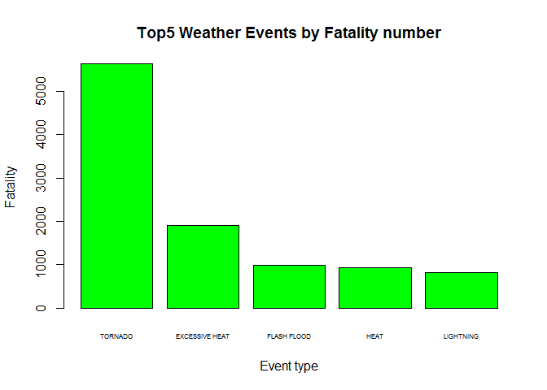
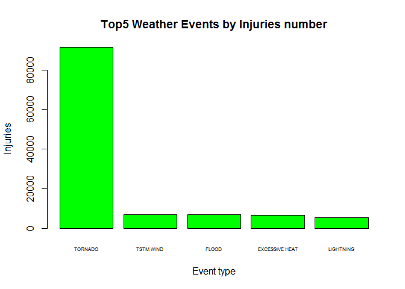
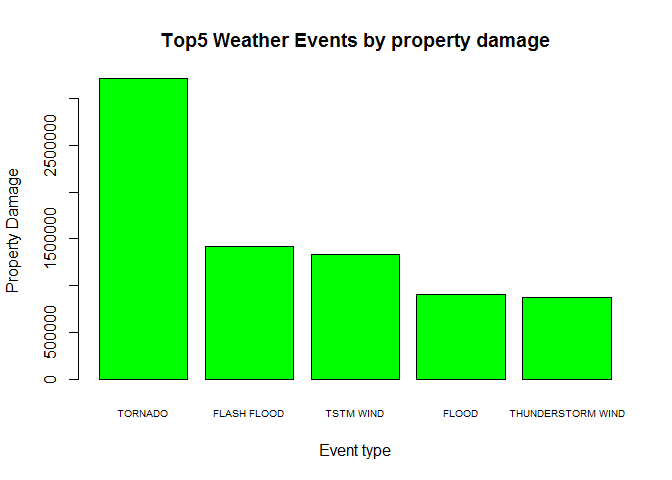

##Synopsis
Here in this report, author analysised the dataset of "Storm DAta" from National Weather Service of US. The events in the database start in the year 1950 and end in November 2011. 
The aim of this report is to address 2 questions:
1.Across the United States, which types of events are most harmful with respect to population health?
2,Across the United States, which types of events have the greatest economic consequences?

##Data processing

The data source is from National Wather Service of US.
[Storm Data](https://d396qusza40orc.cloudfront.net/repdata%2Fdata%2FStormData.csv.bz2)

###Library and Load the data

```r
library(plyr)
library(ggplot2)
Sys.setlocale("LC_ALL", "English")
```

```
## [1] "LC_COLLATE=English_United States.1252;LC_CTYPE=English_United States.1252;LC_MONETARY=English_United States.1252;LC_NUMERIC=C;LC_TIME=English_United States.1252"
```

```r
storm<-read.csv("repdata_data_StormData.csv")
dim(storm)
```

```
## [1] 902297     37
```

```r
colnames(storm)
```

```
##  [1] "STATE__"    "BGN_DATE"   "BGN_TIME"   "TIME_ZONE"  "COUNTY"    
##  [6] "COUNTYNAME" "STATE"      "EVTYPE"     "BGN_RANGE"  "BGN_AZI"   
## [11] "BGN_LOCATI" "END_DATE"   "END_TIME"   "COUNTY_END" "COUNTYENDN"
## [16] "END_RANGE"  "END_AZI"    "END_LOCATI" "LENGTH"     "WIDTH"     
## [21] "F"          "MAG"        "FATALITIES" "INJURIES"   "PROPDMG"   
## [26] "PROPDMGEXP" "CROPDMG"    "CROPDMGEXP" "WFO"        "STATEOFFIC"
## [31] "ZONENAMES"  "LATITUDE"   "LONGITUDE"  "LATITUDE_E" "LONGITUDE_"
## [36] "REMARKS"    "REFNUM"
```
###Processing the data
In this analysis, we concern 3 major elements,namely "event type","population health" and "Economic consequence".Through the "Storm data documentation", we know the related variables are "EVTYPE","FATALITIES","INJURIES"and"PROPDMG"

```r
storm1<-storm[,c("EVTYPE","FATALITIES","INJURIES","PROPDMG")]
```

##Data Analysis
Firstly check the data type of the subset.

```r
head(storm1,3)
```

```
##    EVTYPE FATALITIES INJURIES PROPDMG
## 1 TORNADO          0       15    25.0
## 2 TORNADO          0        0     2.5
## 3 TORNADO          0        2    25.0
```

####To answer Question1, use function ddply()to summarize the Fatalities and Injuries by event type. Then located the maximum value of each respects.

```r
health<-ddply(storm1,("EVTYPE"),summarize,hF=sum(FATALITIES),hI=sum(INJURIES))

health[which.max(health$hF),]
```

```
##      EVTYPE   hF    hI
## 834 TORNADO 5633 91346
```

```r
health[which.max(health$hI),]
```

```
##      EVTYPE   hF    hI
## 834 TORNADO 5633 91346
```

Plot the top5 weather events by Fatalities and Injuries.

```r
hFsorted<-health[order(health[,2],decreasing = TRUE),]
hIsorted<-health[order(health[,3],decreasing=TRUE),]
hFsorted5<-hFsorted[1:5,]
hIsorted5<-hIsorted[1:5,]
barplot(hFsorted5$hF,names.arg=hFsorted5$EVTYPE,cex.names=0.5,col="green",xlab="Event type",ylab="Fatality",main="Top5 Weather Events by Fatality number")
```

<!-- -->

```r
barplot(hIsorted5$hI,names.arg=hIsorted5$EVTYPE,cex.names=0.5,col="green",xlab="Event type",ylab="Injuries",main="Top5 Weather Events by Injuries number")
```

<!-- -->

From the results above, both in Fatalities and in Injuries, Tornado made the max value,which is 5633 persons and 91346persons. We can see Tornado is the most harmful event with respect to population health.

####To answer question2, use function ddply() to summarize the Property damage by event type.

```r
property<-ddply(storm1,("EVTYPE"),summarize,pD=sum(PROPDMG))
property[which.max(property$pD),]
```

```
##      EVTYPE      pD
## 834 TORNADO 3212258
```
Plot top 5 weather events by properties damage.


```r
propertysorted<-property[order(property[,2],decreasing = TRUE),]
propertysorted5<-propertysorted[1:5,]
barplot(propertysorted5$pD,names.arg=propertysorted5$EVTYPE,cex.names=0.6,col="green",xlab="Event type",ylab="Property Damage",main="Top5 Weather Events by property damage")
```

<!-- -->

From the results above, we can see Tornado made the max property damage, which is 3212258, namely, Tornado is the one that have the greatest economic consequence.

##Results
As the conclusion, we can say,across the United States, Tornado are most harmful with respect to population health.Also, Tornado have the greatest economic consequence.
